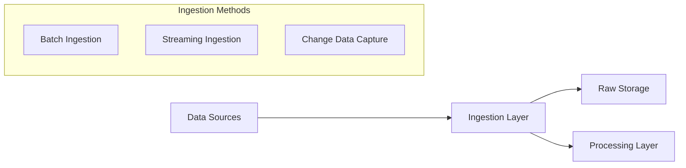
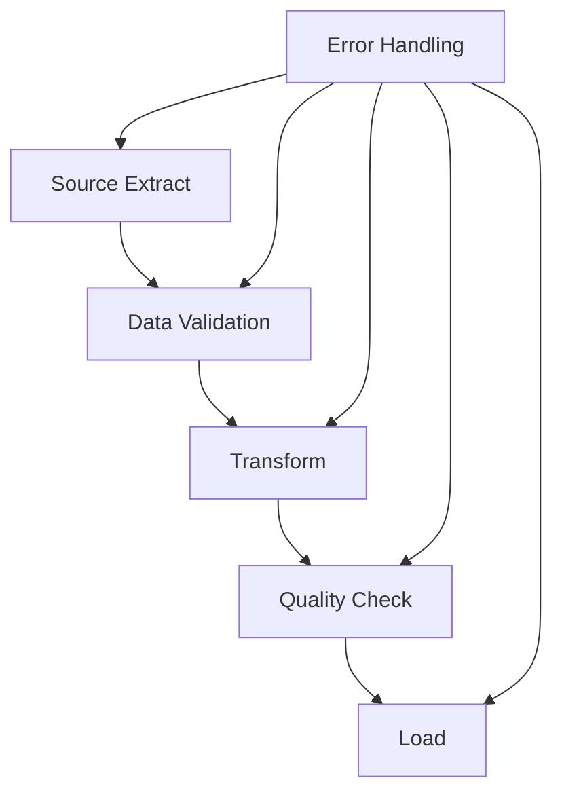
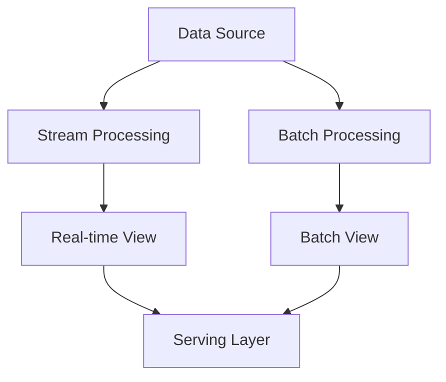
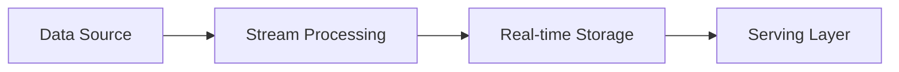

# Data Pipeline Architecture and Components

Data pipeline architectures are composed of multiple interconnected components that work together to move and transform data efficiently. This guide explores the core components, architectural patterns, and implementation considerations for building robust data pipelines.

## Core Components

### 1. Data Sources
Data pipelines begin with one or more data sources. Common source types include:

- **Operational Databases**
  - Relational databases (MySQL, PostgreSQL)
  - NoSQL databases (MongoDB, Cassandra)
  - Time-series databases

- **External APIs**
  - REST APIs
  - GraphQL endpoints
  - SOAP services
  - Webhooks

- **File Systems**
  - Cloud storage (GCS, S3)
  - Local file systems
  - FTP servers

- **Streaming Sources**
  - Kafka topics
  - Pub/Sub messages
  - Event streams

### 2. Ingestion Layer

The ingestion layer is responsible for reliably capturing data from sources and preparing it for processing:



#### Key Features
- Source system connection management
- Data extraction scheduling
- Rate limiting and throttling
- Error handling and retry logic
- Data validation at ingestion
- Monitoring and alerting

### 3. Processing Layer

The processing layer transforms raw data into its desired form through various operations:

#### Common Transformations
```sql
-- Example of typical transformations in BigQuery
WITH raw_data AS (
  SELECT * FROM `project.dataset.raw_table`
),
-- Data cleaning
cleaned_data AS (
  SELECT
    TRIM(id) as id,
    COALESCE(name, 'Unknown') as name,
    SAFE_CAST(amount as FLOAT64) as amount
  FROM raw_data
),
-- Business logic application
transformed_data AS (
  SELECT
    id,
    name,
    amount,
    CASE
      WHEN amount > 1000 THEN 'High Value'
      WHEN amount > 500 THEN 'Medium Value'
      ELSE 'Low Value'
    END as value_segment
  FROM cleaned_data
)
SELECT * FROM transformed_data
```

### 4. Storage Layer

The storage layer manages both intermediate and final data states:

#### Storage Types
- **Staging Areas**
  - Temporary tables for transformation
  - Integration datasets
  - Quality control zones

- **Data Warehouse**
  ```sql
  -- BigQuery table partitioning example
  CREATE TABLE `project.dataset.fact_sales`
  (
    transaction_id STRING,
    product_id STRING,
    sale_date DATE,
    amount NUMERIC,
    processed_at TIMESTAMP
  )
  PARTITION BY DATE(sale_date)
  CLUSTER BY product_id;
  ```

- **Data Lake**
  - Raw data storage
  - Schema-on-read approach
  - Support for unstructured data

### 5. Orchestration Layer

The orchestration layer coordinates the entire pipeline:



#### Key Responsibilities
- Task scheduling and dependency management
- Resource allocation
- Error handling and recovery
- Pipeline monitoring
- SLA management

## Architectural Patterns

### 1. Lambda Architecture

Combines batch and stream processing:



### 2. Kappa Architecture

Treats all data as streams:



### 3. Data Mesh Architecture

Distributed ownership and domain-oriented design:

- Domain-oriented data products
- Self-serve data infrastructure
- Federated governance
- Standardized interoperability

## BigQuery-Specific Implementation

### Resource Organization

```plaintext
project/
├── raw_data/
│   ├── source_system_1/
│   └── source_system_2/
├── staging/
│   ├── intermediate_tables/
│   └── temporary_views/
└── production/
    ├── fact_tables/
    └── dimension_tables/
```

### Performance Optimization

1. **Partitioning Strategy**
```sql
-- Date partitioning with clustering
CREATE TABLE `project.dataset.events`
PARTITION BY DATE(event_timestamp)
CLUSTER BY user_id, event_type;
```

2. **Query Optimization**
```sql
-- Using a date partition filter
SELECT *
FROM `project.dataset.events`
WHERE DATE(event_timestamp) = CURRENT_DATE()
  AND user_id IN (
    SELECT user_id
    FROM `project.dataset.active_users`
  );
```

## Best Practices

1. **Data Quality Management**
   - Implement validation checks at each stage
   - Monitor data completeness and accuracy
   - Set up alerts for anomalies

2. **Resource Management**
   - Optimize slot allocation
   - Implement cost controls
   - Monitor query performance

3. **Security and Governance**
   - Implement row-level security
   - Manage access controls
   - Audit data access and modifications

4. **Monitoring and Maintenance**
   - Track pipeline health metrics
   - Monitor processing times
   - Set up error alerting
   - Maintain documentation