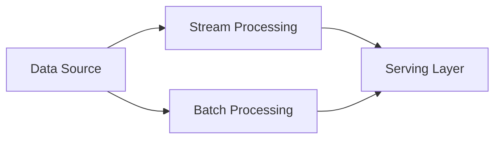

> Suggestion: add `/api/export` to the root URI get an AI-friendly export of the whole knowledge base!

# Introduction to Data Pipelines

Data pipelines are the backbone of modern data engineering, enabling organizations to efficiently process, transform, and move data from various sources to desired destinations. This knowledge base provides comprehensive information about different types of data pipelines, their architectures, and implementation patterns.

## What You'll Learn

- Fundamental concepts and components of data pipelines
- Different types of pipeline architectures
- Implementation strategies and best practices
- Advanced topics like incremental processing

## Getting Started

Navigate through the sections using the sidebar. We recommend starting with the Pipeline Fundamentals section to build a strong foundation before moving to implementation details.

---

# File: pages/fundamentals/architecture.mdx

# Pipeline Architecture and Components

## Core Components

Every data pipeline consists of several key components:

### 1. Source Systems
- Databases (OLTP systems)
- APIs
- File systems
- Streaming platforms

### 2. Ingestion Layer
- Batch ingestion
- Real-time ingestion
- Change Data Capture (CDC)

### 3. Processing Layer
- Data transformation
- Data validation
- Business logic application

### 4. Storage Layer
- Data warehouses
- Data lakes
- Temporary storage

### 5. Orchestration
- Workflow management
- Dependency handling
- Error handling and recovery

## Common Architectural Patterns

### Lambda Architecture
Combines batch and stream processing to provide comprehensive data processing capabilities.

### Kappa Architecture
Treats all data as a stream, simplifying the architecture but potentially increasing complexity in processing logic.

### ETL vs ELT
- ETL: Transform before loading to destination
- ELT: Transform after loading, leveraging modern data warehouse capabilities

## BigQuery-Specific Considerations

When implementing pipelines with BigQuery:

- Use partitioning and clustering for optimal performance
- Leverage BigQuery's serverless nature for scalable processing
- Implement cost controls through appropriate project organization